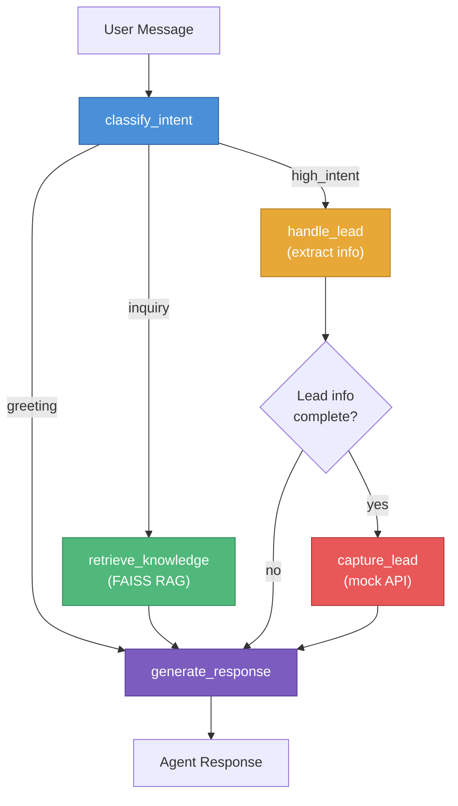

# AutoStream : Social-to-Lead AI Agent

A conversational AI agent built for **AutoStream**, a SaaS product providing automated video editing tools for content creators. The agent identifies user intent, answers product questions using a RAG pipeline, and captures high-intent leads through a structured workflow.

Built as part of the ServiceHive ML Intern assignment.

---

## Table of Contents

- [Features](#features)
- [Tech Stack](#tech-stack)
- [Architecture](#architecture)
- [Project Structure](#project-structure)
- [Setup](#setup)
- [Usage](#usage)
- [Architecture Explanation](#architecture-explanation)
- [WhatsApp Deployment](#whatsapp-deployment)

---

## Features

- **Intent Classification**: Classifies each user message as a greeting, product inquiry, or high-intent lead signal
- **RAG-Powered Responses**: Retrieves accurate pricing and policy information from a local knowledge base using FAISS vector search
- **Lead Capture Workflow**: Collects name, email, and creator platform before triggering the lead capture tool
- **Streaming Responses**: Token-by-token streaming in the Streamlit interface for real-time feedback
- **Activity Panel**: Displays classified intent, pipeline nodes executed, and lead status after each response
- **Multi-Provider LLM Support**: Switch between Groq (Llama 3.3 70B) and Google Gemini via environment variable

---

## Tech Stack

| Component    | Technology                                          |
| ------------ | --------------------------------------------------- |
| Framework    | LangGraph (stateful agent orchestration)            |
| LLM          | Groq (Llama 3.3 70B) / Google Gemini 2.5 Flash Lite |
| Embeddings   | HuggingFace all-MiniLM-L6-v2 (local, free)          |
| Vector Store | FAISS (in-memory)                                   |
| UI           | Streamlit (chat interface with streaming)           |
| Language     | Python 3.13                                         |

---

## Architecture



Each user message triggers one graph invocation. State persists across turns via LangGraph's MemorySaver checkpointer, maintaining conversation history for 5-6+ turns.

---

## Project Structure

```
autostream-agent/
├── knowledge_base/
│   └── autostream.json       # Pricing, features, and policy data
├── src/
│   ├── __init__.py
│   ├── config.py             # LLM and embeddings initialization
│   ├── prompts.py            # System prompts and classification templates
│   ├── rag.py                # FAISS vector store and retrieval pipeline
│   ├── tools.py              # Lead capture mock API
│   └── graph.py              # LangGraph workflow (state, nodes, edges)
├── main.py                   # CLI conversation loop
├── app.py                    # Streamlit chat interface
├── requirements.txt
├── .env.example
└── README.md
```

---

## Setup

### Prerequisites

- Python 3.9+
- A Groq API key (free at [console.groq.com](https://console.groq.com))

### Installation

```bash
git clone https://github.com/vinayakpareek-0/autostream-agent.git
cd autostream-agent

python -m venv venv
# Windows
venv\Scripts\activate
# macOS/Linux
source venv/bin/activate

pip install -r requirements.txt

cp .env.example .env
# Edit .env and add your API key
```

### Environment Variables

```env
# LLM Provider: "groq" (default) or "gemini"
LLM_PROVIDER=groq

# Groq (default)
GROQ_API_KEY=your_groq_api_key_here

# Google Gemini (alternative)
# GOOGLE_API_KEY=your_google_api_key_here
```

---

## Usage

### Streamlit UI (recommended)

```bash
streamlit run app.py
```

### CLI

```bash
python main.py
```

### Sample Conversation

```
You: Hi, tell me about your pricing.
Agent: [Retrieves pricing from knowledge base, responds with Basic and Pro plan details]

You: That sounds good, I want to try the Pro plan for my YouTube channel.
Agent: [Detects high intent, asks for name and email]

You: I'm Alex, email is alex@creator.com
Agent: [Captures lead, confirms sign-up]
```

---

## Architecture Explanation

This agent uses **LangGraph** as its orchestration framework. LangGraph was chosen over alternatives like AutoGen because it provides explicit, graph-based control over the agent's decision-making pipeline. Each capability (intent classification, RAG retrieval, lead handling, response generation) is implemented as a discrete node in a directed graph, with conditional edges that route execution based on the classified intent.

State management is handled through LangGraph's built-in **MemorySaver checkpointer**. The agent state includes conversation messages, classified intent, retrieved context, lead information, and capture status. This state persists across turns using a thread-based session identifier, allowing the agent to maintain coherent multi-turn conversations and accumulate lead details (name, email, platform) across separate messages without losing context.

The RAG pipeline loads a structured JSON knowledge base, converts each entry into a LangChain Document, and indexes them using FAISS with HuggingFace sentence-transformer embeddings. At query time, the retriever fetches the top-2 most relevant chunks and injects them into the response generation prompt, ensuring the agent never hallucinates pricing or policy information.

The lead capture tool is gated behind a completion check, it only fires after all three required fields (name, email, platform) have been collected, preventing premature API calls.

---

## WhatsApp Deployment

To integrate this agent with WhatsApp, the recommended approach uses the **Meta Cloud API** with a webhook-based architecture:

### Overview

1. **Register a WhatsApp Business Account** on the Meta Developer Portal and set up a phone number for the agent.

2. **Deploy the agent as a REST API** using FastAPI or Flask, exposing a `/webhook` endpoint that accepts POST requests.

3. **Configure the webhook URL** in the Meta Developer Portal to point to the deployed API endpoint. Meta will send incoming WhatsApp messages to this URL as JSON payloads.

4. **Process incoming messages** in the webhook handler:
   - Parse the incoming message payload from Meta's API
   - Pass the message text to the LangGraph agent with a thread ID derived from the sender's phone number (ensures per-user conversation state)
   - Send the agent's response back via the Meta Cloud API's `/messages` endpoint

5. **Handle session persistence** by mapping each WhatsApp phone number to a unique LangGraph thread ID. The MemorySaver checkpointer (or a database-backed checkpointer like PostgresSaver for production) maintains conversation state across messages.

### Webhook Flow

```
WhatsApp User --> Meta Cloud API --> Webhook (POST /webhook)
                                          |
                                    LangGraph Agent
                                          |
                                    Meta Cloud API --> WhatsApp User
```

### Key Considerations

- Use HTTPS with a valid SSL certificate for the webhook endpoint
- Implement webhook signature verification to authenticate requests from Meta
- For production, replace MemorySaver with a persistent checkpointer (PostgresSaver or RedisSaver) to handle concurrent users and server restarts
- Deploy on a platform with low latency and high availability (Render, Railway, or AWS)
